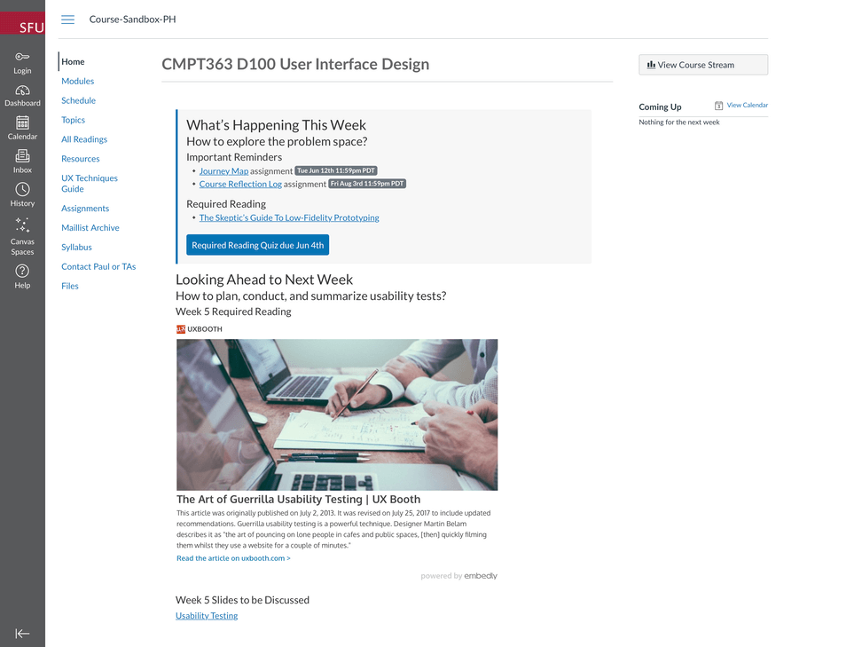

# Docsify-This LMS Content Pages Template

[](https://docsify.js.org/)
[](https://github.com/hibbitts-design/docsify-open-course-starter-kit/blob/main/LICENSE)
<a href="https://discord.gg/zT8eS8ZG">
    
</a>

> This is a set of multiple pages for use with [Docsify-This.net](https://docsify-this.net/#/) for embedding within an LMS.


_Figure 1. Docsify-This LMS Content Pages Template. View the content for an example home page generated by Docsify-This.net at [https://docsify-this.net/?basePath=https://raw.githubusercontent.com/hibbitts-design/docsify-this-lms-content-pages/main&homepage=home.md](https://docsify-this.net/?basePath=https://raw.githubusercontent.com/hibbitts-design/docsify-this-lms-content-pages/main&homepage=home.md) and an example Canvas LMS site using Docsify-This content at https://canvas.sfu.ca/courses/76692_

How to Use
---

1. Tap **Use this template** in this repository (upper-right green button) and then choose **Create a new repository**

2. Choose the name for your new repository to contain the files and then tap **Create repository from template**

3. View one of the provided Markdown files, such as **home.md**, in your newly created repository and copy it's URL

4. Go to https://docsify-this.net and paste the copied URL into the **Markdown File URL** field

5. Select the page options you want (e.g. Font Family) and tap the **View as Standalone Page** button to view your Markdown file as a web page for sharing or embedding

You can further customize the appearance of your web page by tapping on the **Show More Page Options »** link in the Docsfy-This Web Page Builder.

Docsify-This Examples
---

[Docsify-This LMS Content Pages Template](https://github.com/hibbitts-design/docsify-this-lms-content-pages), including the use of the `font-family`, `font-size` and `hide-credits` URL parameters for seamless content embedding within the Canvas LMS, as displayed by Docsify-This:  
* [Embeddable Home Page](https://docsify-this.net/?basePath=https://raw.githubusercontent.com/hibbitts-design/docsify-this-lms-content-pages/main&homepage=home.md&font-family=Lato%20Extended,%20Lato,Helvetica%20Neue,%20Helvetica,%20Arial,%20sans-serif&amp;font-size=1&amp;link-color=0374B5&amp;hide-credits=true "Embeddable Home Page")
* [Embeddable Weekly Module Page](https://docsify-this.net/?basePath=https://raw.githubusercontent.com/hibbitts-design/docsify-this-lms-content-pages/main&homepage=module-01.md&font-family=Lato%20Extended,%20Lato,Helvetica%20Neue,%20Helvetica,%20Arial,%20sans-serif&amp;font-size=1&amp;link-color=0374B5&amp;hide-credits=true "Embeddable Weekly Module Page")
* [Embeddable Schedule Page](https://docsify-this.net/?basePath=https://raw.githubusercontent.com/hibbitts-design/docsify-this-lms-content-pages/main&homepage=schedule.md&font-family=Lato%20Extended,%20Lato,Helvetica%20Neue,%20Helvetica,%20Arial,%20sans-serif&amp;font-size=1&amp;link-color=0374B5&amp;hide-credits=true "Embeddable Schedule Page")
* [Embeddable Topics Page](https://docsify-this.net/?basePath=https://raw.githubusercontent.com/hibbitts-design/docsify-this-lms-content-pages/main&homepage=topics.md&font-family=Lato%20Extended,%20Lato,Helvetica%20Neue,%20Helvetica,%20Arial,%20sans-serif&amp;font-size=1&amp;link-color=0374B5&amp;hide-credits=true "Embeddable Topics Page")
* [Embeddable Resources Page](https://docsify-this.net/?basePath=https://raw.githubusercontent.com/hibbitts-design/docsify-this-lms-content-pages/main&homepage=resources.md&font-family=Lato%20Extended,%20Lato,Helvetica%20Neue,%20Helvetica,%20Arial,%20sans-serif&amp;font-size=1&amp;link-color=0374B5&amp;hide-credits=true "Embeddable Resource Page")
* [Embeddable UX Techniques Guide Page (using Accordion format)](https://docsify-this.net/?basePath=https://raw.githubusercontent.com/hibbitts-design/docsify-this-lms-content-pages/main&homepage=ux-techniques-guide.md&font-family=Lato%20Extended,%20Lato,Helvetica%20Neue,%20Helvetica,%20Arial,%20sans-serif&amp;font-size=1&amp;link-color=0374B5&amp;hide-credits=true "Embeddable UX Techniques Guide Page (using Accordion format)")
* [Embeddable Contact Page](https://docsify-this.net/?basePath=https://raw.githubusercontent.com/hibbitts-design/docsify-this-lms-content-pages/main&homepage=contact.md&font-family=Lato%20Extended,%20Lato,Helvetica%20Neue,%20Helvetica,%20Arial,%20sans-serif&amp;font-size=1&amp;link-color=0374B5&amp;hide-credits=true "Embeddable Contact Page")

Embedding Docsify-This Pages into Other Platforms
---

### Canvas LMS

[Embed content in Canvas](https://www.howtocanvas.com/create-amazing-pages-in-canvas/embedding-content)  
iFrame Code Example, including URL parameters to seamlessly match Docsify-This content to Canvas:  

```html
<p><iframe style="overflow: hidden; border: 0px #ffffff none; background: #ffffff;" src="https://docsify-this.net?basePath=https://raw.githubusercontent.com/paulhibbitts/cmpt-363-222-pages/main&homepage=home.md&font-family=Lato%20Extended,%20Lato,Helvetica%20Neue,%20Helvetica,%20Arial,%20sans-serif&font-size=1&hide-credits=true" width="800px" height="1400px" allowfullscreen="allowfullscreen"></iframe></p>
```

[How do I add an external URL as a module item?](https://community.canvaslms.com/t5/Instructor-Guide/How-do-I-add-an-external-URL-as-a-module-item/ta-p/967)  
Module external link example:  

```html
https://docsify-this.net?basePath=https://raw.githubusercontent.com/paulhibbitts/cmpt-363/main/docs/222&homepage=week-02.md&toc-alt=true&font-family=Lato%20Extended,Lato,Helvetica%20Neue,Helvetica,Arial,sans-serif&font-size=1&hide-credits=true
```

[Redirect Tool (for adding a link as a navigation item in a course )](https://www.eduappcenter.com/apps/63?filter_text=#.X3uex2hKiM8)  
Redirect URL field example:  

```html
https://docsify-this.net/?basePath=https://raw.githubusercontent.com/paulhibbitts/cmpt-363-222-pages/main&homepage=resources.md&edit-link=https://github.com/paulhibbitts/cmpt-363-222-pages/blob/main/resources.md&font-family=Lato%20Extended, Lato,Helvetica%20Neue,Helvetica,Arial,sans-serif&font-size=1&hide-credits=true
```

## Moodle LMS

[iFrame (for embedding content within pages)](https://docs.moodle.org/401/en/Iframe)  

[External tool (for adding a link to course navigation or elements)](https://docs.moodle.org/401/en/External_tool)
